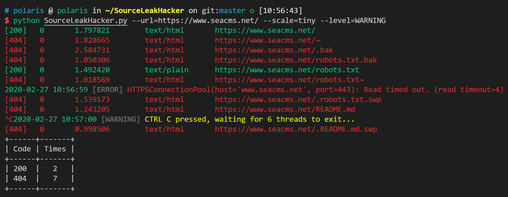
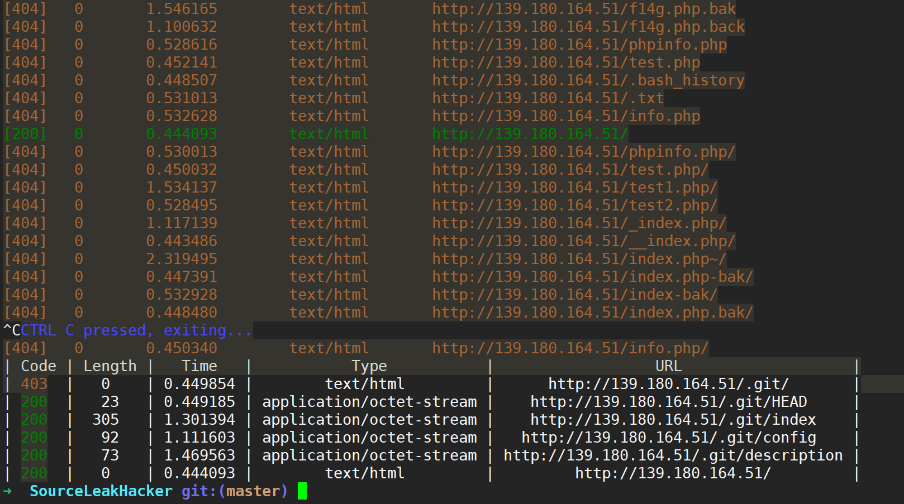
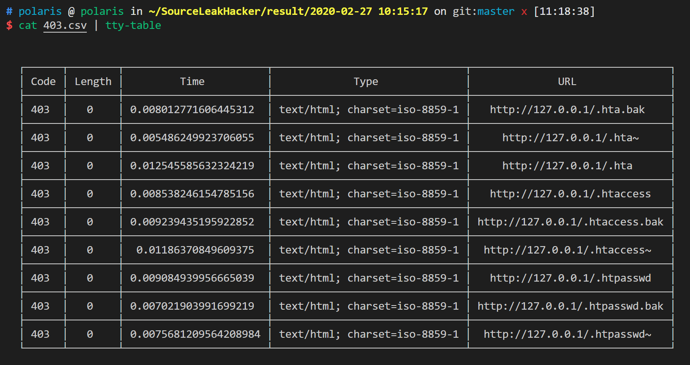

Description
---
```
SourceLeakHacker is a muilt-thread web source leak detector.
```

Dependency
---
```
requests
```

Installation
---
```
pip install -r requirments.txt
```

Usage  　
---

```
Usage :
        python SourceLeakHacker.py [URL] [ThreadNumbers] [Timeout]
Example :
        python SourceLeakHacker.py http://127.0.0.1/ 32 16
Tips :
        32 threadNumber is recommended.
        5 second timeout is recommended.(You can also use a decimal to set the timeout.)
        If you have any questions, please contact [ wangyihanger@gmail.com ]
```


Demo
---




